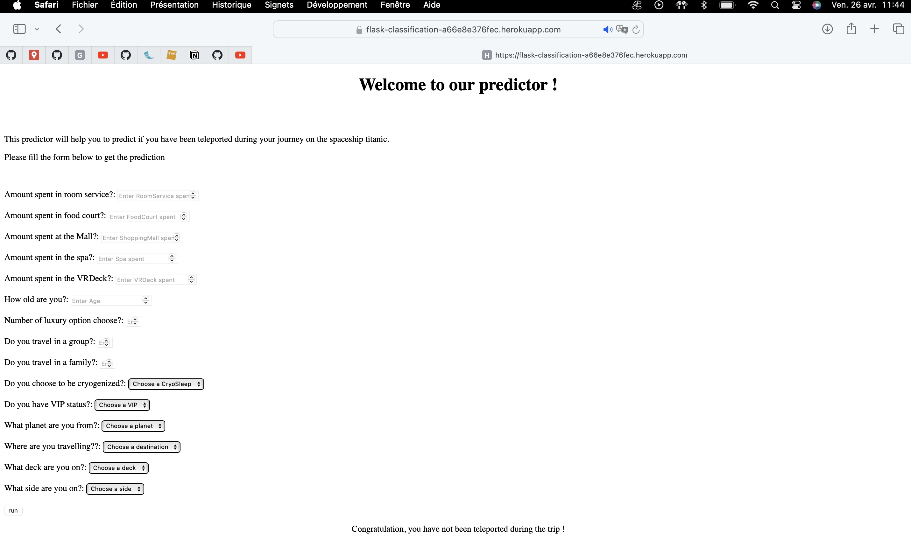

# Projet 1: Analyse de la distribution des films et séries sur Netflix
## Objectif: 
Créer un Dashboard interractif à l'aide de l'outil BI Tableau

### Contenu du Dashboard 
- Nombre total de films et séries.
- Évolution au cours du temps des films et séries.
- Distribution des films et séries selon plusieurs indicateurs:
  - Pays
  - Genres
  - Catégories, etc.

### Étapes clés:
- Import des données
   - Sélection et récupération des données Netflix.
- Data management sur python
   - Nettoyage et préparation des données pour l'analyse.
     - Valeurs manquantes, types des variables, cohérences du noms des variables.
- Écriture de requête SQL
  - Utilisation de SQL pour extraire les informations pertinentes.
    - Select, GROUP BY, Count..
- Utilisation des fonctionnalités de Tableau.
  - Mise en œuvre des différentes fonctions de Tableau pour des représentations efficaces :
     - Cartographie pour la distribution géographique des contenus.
     - Barchart pour la visualisation des données catégorielles.
     - Lineplot pour l'évolution temporelle du contenu.
     - Curseur dynamique pour une interactivité accrue.

### Avantages du Dashboard
- Visualisation claire et précise de la distribution des films et séries sur Netflix.
- Facilité d'accès et d'interaction pour les parties prenantes.
- Possibilité d'identifier les tendances et les préférences des utilisateurs.

### Résultat du Dashboard

### Lien vers les notebooks et vers la visualisation :
- [notebook python](https://github.com/Dudul-99/Portfolio/blob/main/Exploration%20du%20dataframe%20Netflix%20avec%20python.ipynb)
- [notebook R/SQL](https://github.com/Dudul-99/Portfolio/blob/main/code_sql.Rmd)
- [Dashboard Tableau](https://public.tableau.com/app/profile/abdul.boura/viz/DescriptiondesfilmsetsriessurNetflix/Netflix)

# Projet 2: Application R-Shiny pour la visualisation des données de ventes d'une entreprise

## Objectif: 
Développer un Dashboard interactif avec R-Shiny pour présenter les données de ventes de l'entreprise, en mettant l'accent sur différentes sections pour une analyse approfondie.

### Contenu du Dashboard 
- Informations générales :
   - Revenus totaux
   - Profits cumulés
- Informations spécifiques aux clients:
  - Analyse des achats par client
  - Segmentation des clients selon leurs comportements d'achat
- Informations spécifiques aux produits commandés :
  - Top produits vendus
  - Analyse des tendances de vente par produit
- Informations spécifiques sur le mode de livraison :
  - Répartition des modes de livraison utilisés
  - Performance des différents modes de livraison
### Étapes clés:
- Import et gestion des données sur R
  - Utilisation des packages comme dplyr, janitor, readr, et tidyverse pour importer et manipuler les données.
- Transformation des données
  - Utilisation de lubridate et dplyr pour notamment la manipulation des dates et la transformation des données en vue de l'analyse.
- Visualisation
   - Utilisation de packages tels que plotly, highcharter, et shiny pour créer des visualisations interactives dans le Dashboard.

### Avantages du Dashboard
- Offre une vue globale et détaillée des performances de ventes de l'entreprise.
- Permet d'identifier des tendances, des opportunités et des problèmes potentiels.
- Facilite la prise de décision en fournissant des informations pertinentes de manière interactive.

## Résultat du Dashboard

### Lien vers le notebook:
- [Notebook R](https://github.com/Dudul-99/Portfolio/blob/main/Dashboard_ventes.R)

# Projet 3: Prédiction sur la probabilité d'être transporté dans une autre dimension à bord du Space Titanic

## Objectif: 
Développer un modèle de classification binaire pour identifier les individus susceptibles d'être transportés dans une autre dimension à bord du Space Titanic.

### Étapes clés:
- Import des données
  - Récupération des données liées aux passagers du Space Titanic sur Kaggle.

- Analyses exploratoires (EDA)
  - Utilisation de Pandas pour explorer et comprendre la structure des données.
  - Utilisation de Seaborn et Matplotlib pour visualiser les distributions et relations entre les variables.

- Management et data processing des données
  - Gestion des valeurs manquantes.(Imputation simple)
  - Création de variables pertinentes.
  - Encodage des variables catégorielles.(one-hot encoding)
  - Création de pipelines de transformation à l'aide de Scikit-learn.

- Modélisation
  - Sélection des modèles pertinents à notre problématique.
  - Utilisation des modèles de prédiction disponibles dans Scikit-learn.
  - Sélection et hyperparamétrisation des modèles à l'aide de GridSearch pour améliorer les performances.

- Estimation de la qualité du modèle
  - Utilisation de la métrique 'Accuracy' pour évaluer et sélectionner le meilleur modèle.
  - Visualisation de la courbe d'apprentissage pour évaluer les performances du modèle.

- Soumission sur Kaggle
  - Présentation des résultats avec un classement dans les Top 38% sur Kaggle.

- Création d'une application Flask
  - Développement d'une application Flask pour permettre l'utilisation du modèle obtenu en local.

- Déploiement sur le cloud avec Heroku
  - Mise à disposition en ligne de l'application Flask grâce à l'outil Heroku et de GitHub.

### Avantages du projet
- Fournit un modèle de prédiction robuste pour identifier les individus susceptibles d'être transportés dans une autre dimension à bord du Space Titanic.
- Utilisation efficace de techniques de data science pour la préparation, la modélisation et l'évaluation des données.
- Déploiement d'une application pratique en ligne pour une utilisation facile par les utilisateurs finaux.

### Résultats

,  

### Lien vers le notebook:
- [Notebook python](https://github.com/Dudul-99/Portfolio/blob/88979a53103bfed5d5e0984f23f3b4b32cb96564/space_titanice.ipynb)

### Lien vers la compétion:
- [Compétition spaceship](https://www.kaggle.com/competitions/spaceship-titanic/leaderboard#)

# Projet 4: Prédiction du prix des maisons de la ville d'Ames dans l'iowa (États-Unis).

## Objectif: 
Exploiter le jeu de données fourni par Kaggle afin de prédire le prix des maisons à Ames, Iowa, en utilisant les informations disponibles.

### Étapes clés:
- Import des données
  - Extraction des données du jeu de données fourni par Kaggle.

- Data management et visualisation des variables
  - Exploration des caractéristiques des données.(Pandas)
  - Visualisation des distributions et des relations entre les variables.(Seaborn, matplotlib)

- Exploration des relations entre les variables explicatives et la variable cible
  - Analyse des corrélations entre les variables explicatives et le prix des maisons.

- Sélection des modèles de machine learning adaptés à notre objectif
  - Choix des algorithmes de régression adaptés à la prédiction du prix des maisons.

- Entraînement des modèles sur les données 'Train'
  - Division des données en ensembles d'entraînement et de validation.
  - Entraînement des modèles sélectionnés sur les données d'entraînement.

- Évaluation de la qualité du modèle sur critères retenus (RMSE)
  - Utilisation de la racine de l'erreur quadratique moyenne (RMSE) pour évaluer la performance des modèles.

- Utilisation du modèle entraîné sur les données 'Test' pour prédire le prix
  - Application du modèle entraîné sur un ensemble de données de test pour prédire les prix des maisons.

- Soumission des résultats sur Kaggle
  - Soumission des prédictions sur Kaggle pour évaluation.

## Résultats
Ce travail a permis de finir dans le Top 5% de Kaggle sur cette compétition, démontrant ainsi l'efficacité du modèle développé pour prédire le prix des maisons à Ames, Iowa.

 

### Lien vers le notebook:
- [Notebook python](https://github.com/Dudul-99/Portfolio/blob/main/house_prediction.ipynb)

### Lien vers la compétition:
- [Compétition Kaggle](https://www.kaggle.com/competitions/home-data-for-ml-course/overview)

