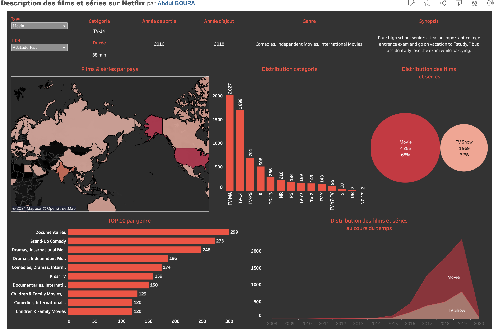
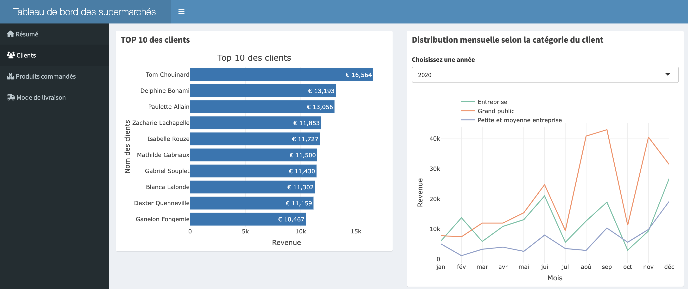

# Projet 1: Analyse de la distribution des films et séries sur Netflix
## Objectif: Créer un Dashboard 
- Nombre total de films et séries
- Évolution au cours du temps des films et séries
- Distribution des films et séries selon plusieurs indicateurs (Pays, genres, catégories, etc.

## Étapes clés:
- Import des données 
- Data management sur python
- Écriture de requête SQL afin de visualiser les informations pertinentes 
- Utilisation des différentes fonctions de Tableau pour différentes représentations:
  - Cartographie
  - Barchart
  - Lineplot
  - Curseur dynamique
 
## Résultat du Dashboard

### Lien vers les notebooks et vers la visualisation :
- [notebook python](https://github.com/Dudul-99/Portfolio/blob/main/Exploration%20du%20dataframe%20Netflix%20avec%20python.ipynb)
- [notebook R/SQL](https://github.com/Dudul-99/Portfolio/blob/main/code_sql.Rmd)
- [Dashboard Tableau](https://public.tableau.com/app/profile/abdul.boura/viz/DescriptiondesfilmsetsriessurNetflix/Netflix)

# Projet 2: Application R-Shiny afin de visualiser les données de ventes d'une entreprise

## Objectif: Créer un Dashboard avec plusieurs sections
- Information générale avec les revenus et les profits
- Information spécifique aux clients
- Information spécifique aux produits commandés
- Information spécifique sur le mode de livraison

## Étapes clés:
- Import et management des données sur R  (dplyr, janitor, readr, tidyverse)
- Transformation des données (lubridate, dplyr)
- Visualisation (plotly, highcharter, shinny)

## Résultat du Dashboard

### Lien vers le notebook:
- [Notebook R](https://github.com/Dudul-99/Portfolio/blob/main/Dashboard_ventes.R)

# Projet 3: Prédiction sur la probabilité d'être transporté dans une autre dimension à bord du Space Titanic

## Objectif: Développer un modèle de classification binaire afin d'identifier les individus transporté dans une autre dimension

## Étapes clés:
- Import des données
- Analyses exploratoires (pandas)
- Managements et data processing des données (création de variables,gestions des valeurs manquantes,encoding des variables, créations de pipeline de transformation)
- Visualisation des variables (seaborn/matplotlib)
- Modelisation (utilisation des modèles de prédiciton sur Scikit-learn et sélection/hyperparamétrisation à l'aide de GridSearch)
- Estimation de la qualité du modèle (utilisation de la métrique 'Acuracy' pour sélectionner le meilleur modèle, visualisation de la courbe d'apprentissage)
- Soumission sur Kaggle avec classement dans les Top 38%

## Résultats

 

### Lien vers le notebook:
- [Notebook python](https://github.com/Dudul-99/Portfolio/blob/88979a53103bfed5d5e0984f23f3b4b32cb96564/space_titanice.ipynb)

# Projet 4: Prédiction du prix des maisons de la ville d'Ames dans l'iowa (US).

## Objectif: Exploiter le jeu de donnée fournit par kaggle afin de prédire le prix des maisons à l'aide des informations disponibles. 

## Étapes clés:
- Import des données
- Data management et visualisations des variables 
- Exploration des relations entre les variables explicatives et la variable cible
- Selection des modèles de machine learning adapté à notre objectif
- Entraînement des modèles sur données 'Train'
- Evaluation de la qualité du modèle sur critères retenue (ici RMSE ou racine de l'erreur quadratique moyenne)
- Utilisation du modèle entrainé sur les données 'Test' afin de prédire le prix
- Soumission des résulats sur Kaggle

## Résultats

Ce travail m'a permit de finir dans le Top 5% de Kaggle sur cette compétition.

 

### Lien vers le notebook:
- [Notebook python](https://github.com/Dudul-99/Portfolio/blob/main/house_prediction.ipynb)

### Lien vers la compétition:
- [Compétition Kaggle](https://www.kaggle.com/competitions/home-data-for-ml-course/overview)

